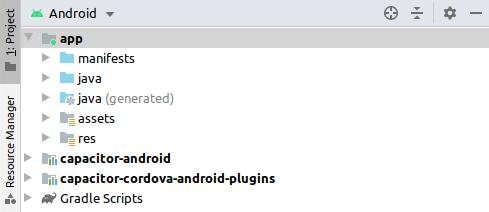
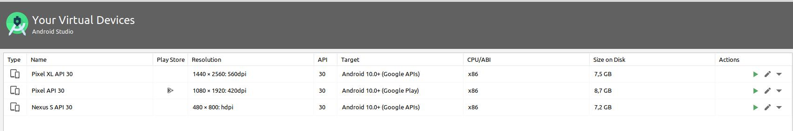
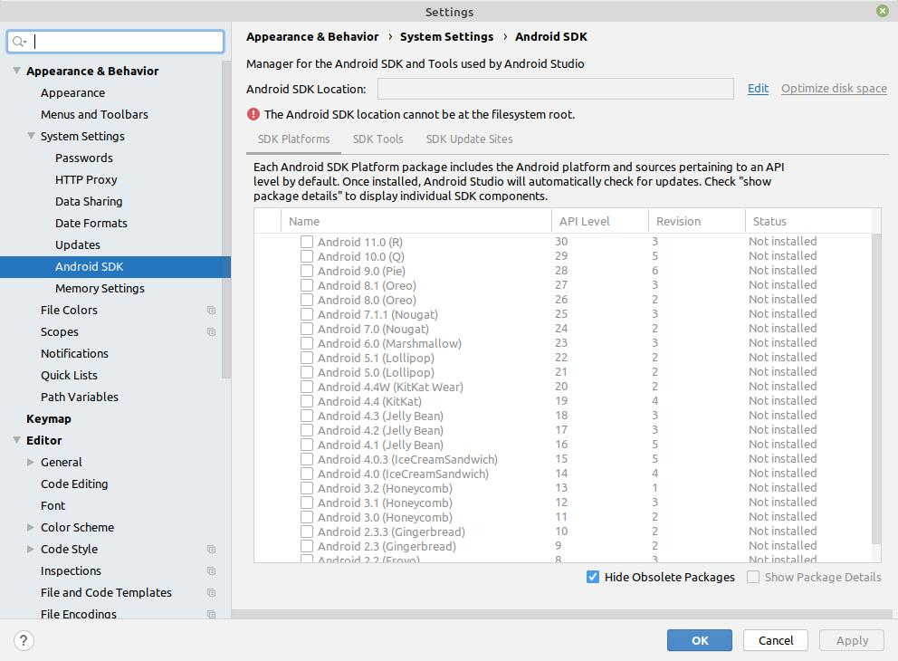
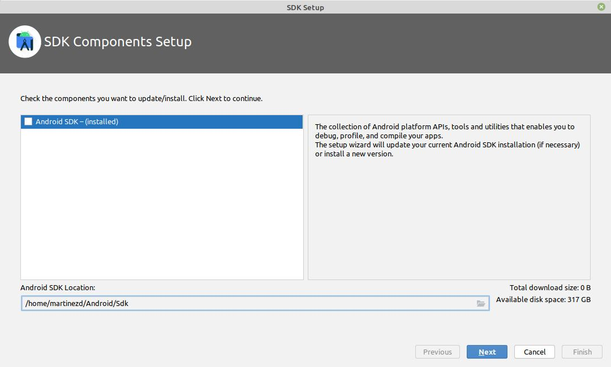
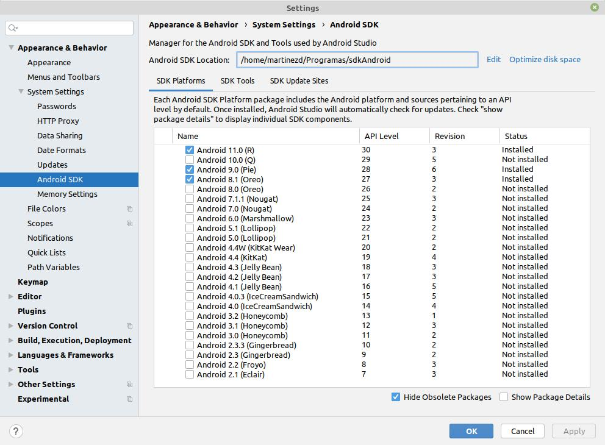

## IDE Principal

Todo el desarrollo se ha realizado mediante el uso de Visual Studio Code
Esta herramienta permite el desarrollo de caracter nativo mediante el uso del superset TypeScripc

[Visual Studio Code](https://ionicframework.com/docs/components) VSC.

## Uso del aplicativo

[Ionic](https://ionicframework.com/docs/components) Ionic framework TypeScript.

Para el uso del aplicativo debe seguir las siguientes pasos:

## Inicio del Aplicativo

Las siguientes indicaciones están propuestas sólo para un ambiente de prueba o testing

## 1) Copiar carpeta

Descomprimir la carpeta denominda app-plataforma en la ubicación que desee.
Moverse a la raiz de la carpeta y ejecutar el siguiente comando:

```bash
# instalación de librerías node_modules
$ npm i
```

```bash
# Compilación de código. Generará carpeta www
$ ionic build
```

# 2) Android Studio

Se deberá descargar el IDE desde la página oficial [Android_Studio](https://developer.android.com/studio/)

## Ejecución de código mediante Ionic Capacitor

En el archivo capacitor.config.json se debera establecer la ruta en la cual se instaló Android Studio.

```
"linuxAndroidStudioPath": "/path/to/android-studio/bin/studio.sh"
```

En este caso se ha instalado bajo un ambiente Linux. Para Windows se deberá colocar la ruta en la que se instaló el IDE

Luego de instalar Android se procede a trabajar con Capacitor:

```bash
# Comando que agrega todas las librerías para trabajar con Android Studio
$npx cap add android
```

Ejecución de código dentro del IDE Android Studio

```bash
# Comando para ejecutar el código dentro del IDE Android Studio
$npx cap open android
```

Este proceso hará que se abra el IDE de Android, se coloque el código dentro del IDE, el cual posteriormente se ejecutará dentro del IDE Android Studio



Cuando haya terminado de colocar el código en el IDE, se procede a ejecutar el emulador de Android Studio ejecutando el botón "play".

Antes de ejecutar "play", hay que verificar si se tiene instalado las respectivas "Virtual Devices" para poder ejecutar el código.



Una vez que se ha verificado los VD se procede a dar play para que abra el emulador respectivo


## 3) SDK de Android (En el caso que no tenga instalado el SDK)

Para que el IDE Android Studio funcione correctamente, este debe configurarse correctamente la ruta donde se encuentre el SDK (Software Development Kit)

1. Verificar si tiene instalado el SDK



Si no se dispone del SDK, se deberá dar clic en la opción "Edit" marcada con color azul - celeste



Dar la unicación dónde quiere que se guarde el SDK

Una vez finalizada la instalación, proceda a escoger los emuladores con los que se vaya a hacer pruebas para el sistema



De igual manera, este proceso puede tomar su tiempo de instalación

Cierre el IDE y vuelva a abrirlo.

## Repositorio

Todo el código fuente se encuetra en:

[GitHub - Cliente Plataforma](https://github.com/DM-UOC/app-plataforma/tree/desarrollo) Repositorio para Cliente - Front End del sistema de plataforma de educación
